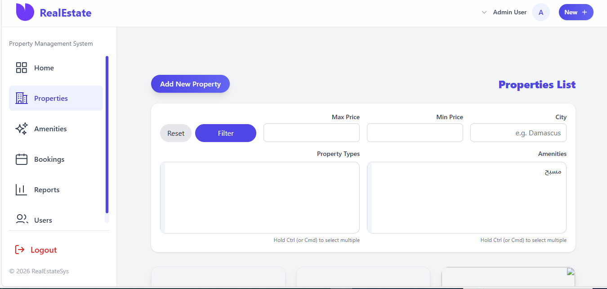
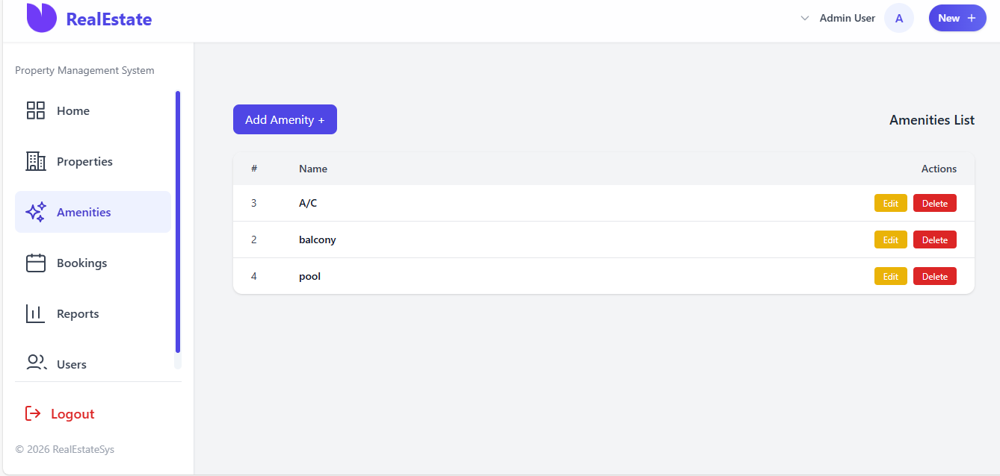
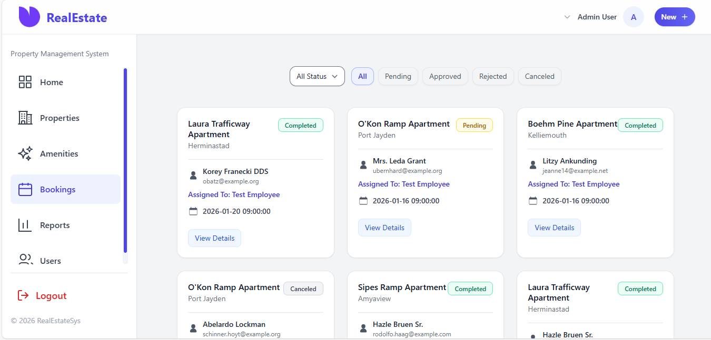

# 🏠 Property Management System
A comprehensive and integrated platform for browsing, booking, and managing properties, with robust features for both tenants and property administrators.


## 📸 Screenshots







## 📚 Table of Contents
- [🏠 Property Management System](#-property-management-system)
- [📸 Screenshots](#-screenshots)
- [📚 Table of Contents](#-table-of-contents)
- [🚀 Project Overview](#-project-overview)
- [⚙️ Requirements](#️-requirements)
- [🛠 Installation & Setup](#-installation--setup)
  - [1. Clone the Repository](#1-clone-the-repository)
  - [2. Install Dependencies](#2-install-dependencies)
  - [3. Configure Environment](#3-configure-environment)
  - [4. Set Up the Database](#4-set-up-the-database)
  - [5. Run the Application](#5-run-the-application)
- [👥 System Roles](#-system-roles)
- [🗄 Database Structure](#-database-structure)
  - [users](#users)
  - [properties](#properties)
  - [bookings](#bookings)
  - [reviews](#reviews)
- [🔗 Interfaces & Routes](#-interfaces--routes)
- [📚 API Documentation](#-api-documentation)
  - [🔐 Authentication](#-authentication)
  - [🏠 Properties](#-properties-1)
  - [📅 Bookings](#-bookings-1)
  - [⭐ Reviews](#-reviews-1)
- [🧾 Sample Responses](#-sample-responses)
  - [Property Response:](#property-response)
  - [Booking Response:](#booking-response)
- [🔑 Sample Credentials](#-sample-credentials)
  - [👨‍💼 Admin](#-admin)
  - [👨‍💻 Employee](#-employee)
  - [👤 Client](#-client)
- [📞 Support \& Contributions](#-support--contributions)
- [🏆 Acknowledgments](#-acknowledgments)
  - [🎉 Special Thanks](#-special-thanks)
  - [Mentors](#mentors)
  - [Development Team](#development-team)

## 🚀 Project Overview
The Property Management System is a full-stack Laravel application designed to:

✅ **Allow user registration and authentication**  
🏠 **Enable property browsing with detailed information**  
📅 **Let users book properties and track booking status**  
📊 **Provide admin dashboard for property and user management**  
🔐 **Enforce role-based access control for admins, employees, and clients**

## ⚙️ Requirements
| Component | Version |
|-----------|---------|
| PHP | ≥ 8.2 |
| Composer | Latest |
| Laravel | 12.x |
| Database | MySQL |
| Node.js | Latest (v18+) |

## 🛠 Installation & Setup
### 1. Clone the Repository
```bash
git clone https://github.com/Ebla-a/property-management.git
cd property-management
```

### 2. Install Dependencies
```bash
composer install      # PHP dependencies
npm install           # JS dependencies
```

### 3. Configure Environment
```bash
cp .env.example .env
php artisan key:generate
```

### 4. Set Up the Database
```bash
php artisan migrate --seed
```

### 5. Run the Application
```bash
php artisan serve     # Start Laravel dev server
npm run dev           # Compile frontend assets with Vite
```

## 👥 System Roles
| Role | Permissions | Dashboard Route |
|------|-------------|-----------------|
| Admin | Full system access | `/admin` |
| Employee | Manage bookings & properties | `/employee` |
| Client | View properties, make bookings | `/dashboard` |

## 🗄 Database Structure
### users
`id, name, email, password, role, created_at, updated_at`

### properties
`id, title, description, price, location, images, status, created_at`

### bookings
`id, user_id, property_id, booking_date, status, notes, created_at`

### reviews
`id, user_id, property_id, booking_id, rating, comment, created_at`

## 🔗 Interfaces & Routes
| Page | Route | Description |
|------|-------|-------------|
| Admin Dashboard | `/admin` | Full system management |
| Employee Panel | `/employee` | Manage properties and bookings |
| Property Browsing | `/properties` | Public property interface |
| Login Page | `/login` | Login for all roles |

## 📚 API Documentation
### 🔐 Authentication
| Method | Endpoint | Description |
|--------|----------|-------------|
| POST | `/api/register` | Register a new user |
| POST | `/api/login` | User login |
| POST | `/api/logout` | Logout (with token) |

### 🏠 Properties
| Method | Endpoint | Description |
|--------|----------|-------------|
| GET | `/api/properties` | List all properties (paginated) |
| GET | `/api/properties/{id}` | Fetch property details |
| POST | `/api/properties` | Create new property (admin only) |
| PUT | `/api/properties/{id}` | Update property (admin only) |
| DELETE | `/api/properties/{id}` | Delete property (admin only) |

### 📅 Bookings
| Method | Endpoint | Description |
|--------|----------|-------------|
| GET | `/api/bookings` | List bookings (role-based filtering) |
| POST | `/api/bookings` | Create new booking (client) |
| GET | `/api/bookings/{id}` | Get booking details |
| PUT | `/api/bookings/{id}/status` | Update status (employee/admin) |
| DELETE | `/api/bookings/{id}` | Cancel booking (employee/client/admin) |

### ⭐ Reviews
| Method | Endpoint | Description |
|--------|----------|-------------|
| GET | `/api/properties/{id}/reviews` | Get all reviews for a property |
| POST | `/api/reviews` | Submit a review (client) |

## 🧾 Sample Responses
### Property Response:
```json
{
  "id": 1,
  "title": "Modern Apartment Downtown",
  "description": "Beautiful modern apartment in city center",
  "price": 1200,
  "location": "City Center",
  "images": ["apt1.jpg", "apt2.jpg"],
  "status": "available"
}
```

### Booking Response:
```json
{
  "id": 5,
  "booking_date": "2024-03-15",
  "status": "confirmed",
  "notes": "Early check-in requested",
  "user": {
    "id": 2,
    "name": "Ahmed",
    "email": "ahmed@email.com"
  },
  "property_id": 1,
  "property_title": "Modern Apartment Downtown"
}
```

## 🔑 Sample Credentials
### 👨‍💼 Admin
**Email:** admin@example.com  
**Password:** password123

### 👨‍💻 Employee
**Email:** employee@property.com  
**Password:** 12345678


## 📞 Support & Contributions
If you find bugs, need help, or would like to contribute:

1. **Open an issue** on the [GitHub repo](https://github.com/Ebla-a/property-management.git)
2. **Fork and submit a pull request**
3. **Contact the team** for feedback or collaboration

## 🏆 Acknowledgments
### 🎉 Special Thanks
**Focal X Agency**  
For their commitment to student growth and learning opportunities.

### Mentors
**Mr. Hashim Othman**  
- Technical guidance
- Concept clarification
- Inspirational mentorship

**Mr. Ayham Ibrahim**  
- Support throughout development

**Supervisors**
Ms Nourhan almohammed & Ms Muna alrays
Technical support and daily follow-up

**Focal X Team**  
For building and supporting this educational journey
ceo and founder Alaa Darwish

### Development Team
| Role | Name |
|------|------|
| Lead Developer | Ebla zyab ali |
| Assistant Developer | Hasan Dayoub |
| Frontend Specialist | Wajd Heshme |
| Backend Developer | Amin Ali |
| Database Specialist | Enas |
| Backend Developer | Abdullah Shuraitah |

---

*Thank you to all educators, mentors, and contributors who made this project a reality.*